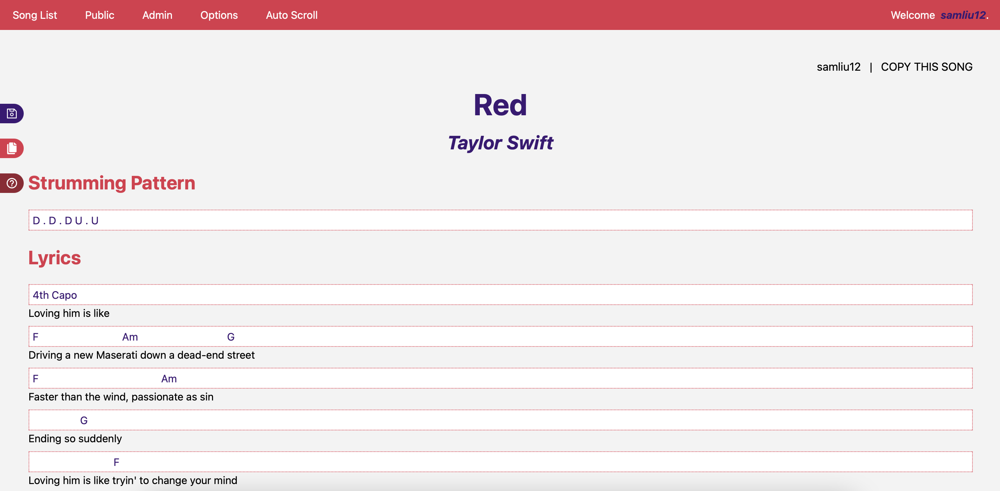

# Lyrics & Chords Songsheet Creator

## Live Website
https://lyrics-chords.herokuapp.com/

## API Documentation
https://github.com/samliu21/lyrics-chords/blob/master/API_Documentation.md

## Usage
This website was created for my needs as a learning guitarist, but I thought I'd share it with the GitHub community! It offers a broad range of songsheet capabilities that include lyric scraping, adding chords and strumming patterns, auto scrolling, and more! 

You can also look at public songsheets that other guitarists have publicized! 

**Technologies Used**: React, Django, PostgreSQL, SQLite, Redux, DRF, Python, JavaScript, HTML, CSS

A sample session can be found here:

## Local Installation

### General
1. Run `git clone https://github.com/samliu21/lyrics-chords` in bash. 
2. Navigate to `lyrics-chords/`

### Backend Installation
1. Install `pipenv` with `pip install pipenv`.
2. Call `pipenv install`, followed by `pipenv shell` to activate the virtual environment and install required dependencies.
3. Finally, call `python manage.py runserver` to run the server.

### Frontend Installation
1. Call `npm ci`.
2. Run the server with `npm start`

### API Key
1. Create an API token here: https://genius.com/api-clients (note that this is NOT the client ID or the client secret). This API key is used for the lyric scraping feature of the website
3. Make a `/.env` file and add `API_KEY=<your_api_key` into the file.

### Prerequisites
- If you don't have `pip` installed, you can do so here: https://pip.pypa.io/en/stable/installing/.
- If you don't have `npm` installed, you can do so here: https://docs.npmjs.com/downloading-and-installing-node-js-and-npm 
- Note that it is necessary to have Python 3.9 available on your machine
